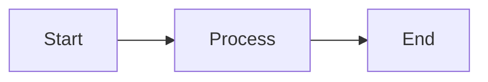
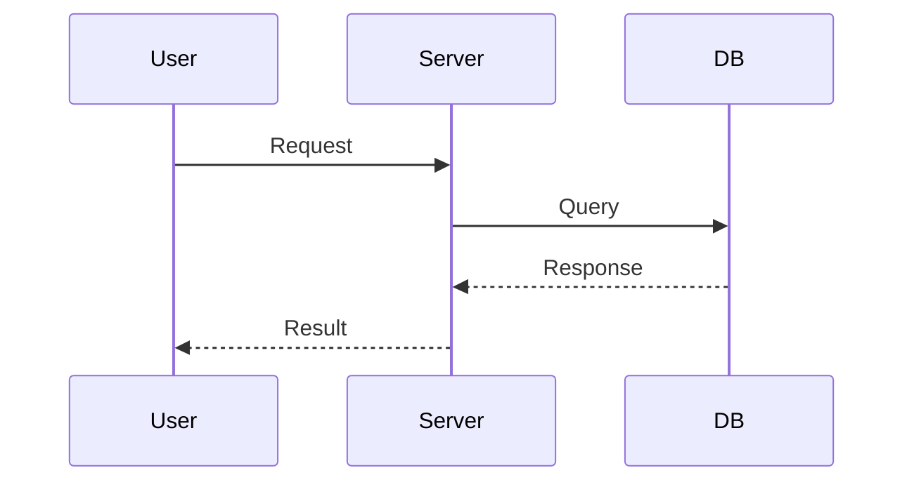
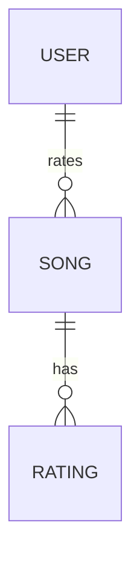
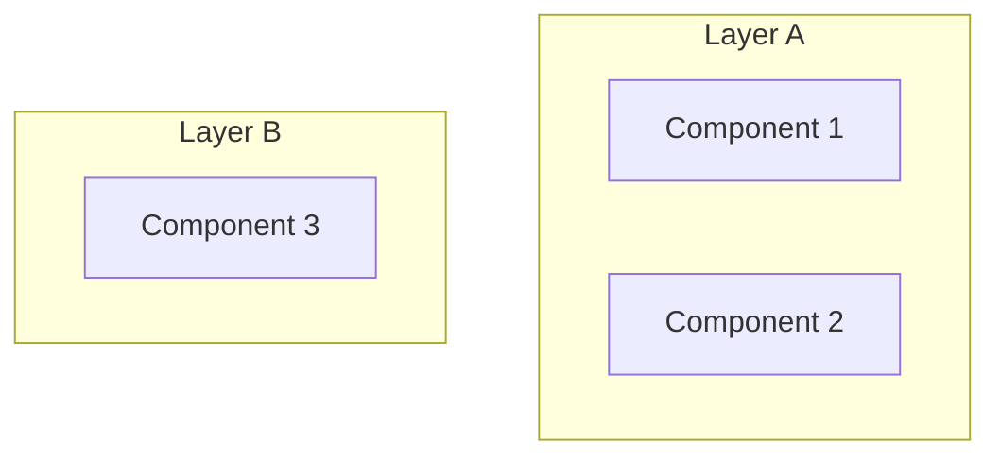

# Architecture Diagrams - Viewing Guide

Complete guide to viewing and using the system architecture diagrams in Radio Calico.

## Quick Answer

✅ **Diagrams work perfectly with clean or edited builds**
- No installation required
- No build dependencies
- No breaking changes
- Native support in GitHub, VS Code, and most markdown tools

---

## Architecture Diagrams Overview

**Location:** [ARCHITECTURE.md](ARCHITECTURE.md) (414 lines, 14 KB)

**Content:** 9 comprehensive Mermaid diagrams
1. High-Level Architecture (components, layers)
2. Component Architecture (detailed structure)
3. Data Flow (user rating workflow)
4. Docker Deployment (dev & prod stacks)
5. API Endpoints (routes & responses)
6. Database Schema (ER diagram)
7. Performance Optimization (8 layers)
8. Deployment Environments (progression)
9. Security Architecture (9 layers)

---

## Viewing Methods

### Method 1: GitHub (Recommended)
**Works automatically — no setup needed**

1. Navigate to [radiocalico/ARCHITECTURE.md](https://github.com/pkjha-aero/Udemy_ClaudeCode_SundogEdu/blob/main/radiocalico/ARCHITECTURE.md)
2. Diagrams render automatically inline
3. No installation or configuration required

**Supported Mermaid features:**
- ✅ All diagram types (graph, sequence, ER, etc.)
- ✅ Colors, styling, emoji
- ✅ Subgraph nesting
- ✅ Interactive zoom/pan (in preview)

---

### Method 2: VS Code (Local)
**Best for local development**

**Setup (1 minute):**
1. Open VS Code
2. Go to Extensions (Ctrl+Shift+X / Cmd+Shift+X)
3. Search: "Markdown Preview Mermaid Support"
4. Install (by Matt Bierner)
5. Open ARCHITECTURE.md
6. Click "Open Preview to the Side" (Ctrl+K V)

**Result:** Diagrams render live as you edit

**Supported:**
- ✅ All Mermaid diagram types
- ✅ Real-time rendering
- ✅ Copy/paste diagram code

---

### Method 3: Mermaid Live Editor (Web)
**Best for sharing and interactive exploration**

1. Go to https://mermaid.live/
2. Paste diagram code from ARCHITECTURE.md
3. Edit and experiment interactively
4. Export as PNG, SVG, or PDF

**Use cases:**
- Experimenting with diagram changes
- Exporting for presentations
- Sharing individual diagrams
- Learning Mermaid syntax

**No account required — completely free**

---

### Method 4: GitLab (if using GitLab)
**Works automatically like GitHub**

GitLab has native Mermaid support. Diagrams render inline when viewing ARCHITECTURE.md.

---

### Method 5: Other Markdown Viewers
**Notion, Confluence, Obsidian, etc.**

Most modern markdown tools support Mermaid:
- Notion: Paste markdown, Mermaid renders
- Confluence: Install Mermaid macro
- Obsidian: Install Mermaid plugin
- HackMD: Automatic support

Check your tool's documentation for Mermaid support.

---

## Exporting Diagrams (Optional)

### Option A: Export Individual Diagrams

**Using Mermaid Live Editor:**
1. Go to https://mermaid.live/
2. Paste diagram code
3. Click "Download" → PNG, SVG, or PDF

**Best for:** Presentations, reports, single diagrams

### Option B: Export All Diagrams at Once

**Using mermaid-cli (optional tool):**

**Install:**
```bash
npm install -g @mermaid-js/mermaid-cli
```

**Export to HTML:**
```bash
make arch-html
# or manually:
mmdc -i ARCHITECTURE.md -o ARCHITECTURE.html
```

**Export to PNG:**
```bash
mmdc -i ARCHITECTURE.md -o ARCHITECTURE.png
```

**Export to SVG:**
```bash
mmdc -i ARCHITECTURE.md -o ARCHITECTURE.svg
```

---

## Build Compatibility

### Clean Build
```bash
make clean
make build
```
**Result:** ✅ Works perfectly
- Diagrams NOT required for builds
- No mermaid dependencies in Dockerfile
- No npm/Node.js installation needed
- ARCHITECTURE.md is documentation only

### Edited Build
```bash
make dev
make test
make prod
```
**Result:** ✅ Works perfectly
- Editing ARCHITECTURE.md doesn't affect builds
- Diagrams are pure documentation
- No compilation or processing step
- Changes take effect immediately when viewed

### Docker Builds
```bash
docker build --target=dev -t radiocalico:dev .
docker build --target=prod -t radiocalico:prod .
```
**Result:** ✅ Works perfectly
- Docker images don't include mermaid-cli
- Images stay lean (~380MB prod, ~520MB dev)
- Diagrams not embedded in images
- View diagrams on host machine or GitHub

---

## Architecture Diagram Dependencies

### What's Included
- ✅ Mermaid diagram code (in ARCHITECTURE.md)
- ✅ Standard Markdown syntax
- ✅ No special build tools required

### What's NOT Included
- ❌ mermaid-cli (optional only, not required)
- ❌ Node.js/npm (only if you want to export)
- ❌ Build dependencies

### Why This Design
- Keeps dependencies minimal
- Works in any git platform (GitHub, GitLab, Gitea)
- Renders natively without plugins (mostly)
- Optional tooling for power users who need PNG/SVG exports

---

## Frequently Asked Questions

### Q: Do I need to install anything to view diagrams?
**A:** No. GitHub renders them automatically. For local editing, install the VS Code extension (optional).

### Q: Will diagrams break a clean build?
**A:** No. They're pure documentation. Clean builds work perfectly.

### Q: Can I export diagrams to images?
**A:** Yes, but it's optional:
- Use Mermaid Live Editor (web, no installation)
- Or install mermaid-cli (npm, only if you need batch exports)

### Q: Are diagrams required for production?
**A:** No. They're documentation only. Production builds work without them.

### Q: Can I edit the diagrams?
**A:** Yes! Edit ARCHITECTURE.md in your text editor:
1. Modify Mermaid code blocks
2. Test in VS Code or Mermaid Live Editor
3. Commit changes
4. Diagrams update on GitHub automatically

### Q: What if my markdown viewer doesn't support Mermaid?
**A:** Use Mermaid Live Editor (https://mermaid.live/) to view diagrams online.

### Q: Does mermaid-cli get installed in Docker?
**A:** No. Docker images don't include it. They stay lean.

---

## Recommended Setup

**For most users (GitHub viewing):**
- Just use GitHub to view diagrams
- Install VS Code extension for local editing
- No other tools needed

**For power users (presentations, exports):**
- Use Mermaid Live Editor for occasional exports
- OR install mermaid-cli for batch processing
- Both are optional

**For contributors:**
- Clone repo
- Edit ARCHITECTURE.md
- Install VS Code extension for preview
- Test changes locally
- Commit and push
- GitHub renders updated diagrams automatically

---

## Mermaid Diagram Syntax Examples

### Simple Flowchart


### Sequence Diagram


### ER Diagram


### Subgraph with Styling


For more examples and syntax, see [Mermaid documentation](https://mermaid.js.org/).

---

## Troubleshooting

### Diagrams don't render on GitHub
**Solution:** GitHub should support Mermaid natively. If not:
1. Refresh page
2. Try incognito/private mode
3. Use Mermaid Live Editor as fallback

### Diagrams don't render in VS Code
**Solution:** Install extension "Markdown Preview Mermaid Support"
- Ctrl+Shift+X → Search → Install
- Reload VS Code
- Open ARCHITECTURE.md
- Ctrl+K V to open preview

### mermaid-cli install fails
**Solution:** mermaid-cli is optional, not required
- You can skip installation
- Use Mermaid Live Editor instead
- Or use a different markdown-to-image tool

### Docker build includes ARCHITECTURE.md?
**Answer:** Yes, ARCHITECTURE.md is copied to Docker images but:
- It's documentation only (~14 KB)
- Doesn't affect application functionality
- Can be removed from Dockerfile if desired
- Includes useful reference in containers

---

## Summary

| Aspect | Status |
|--------|--------|
| **View on GitHub** | ✅ Works (automatic) |
| **View in VS Code** | ✅ Works (with extension) |
| **Export to images** | ✅ Optional (Mermaid Live Editor or CLI) |
| **Build dependency** | ❌ No (pure documentation) |
| **Clean build** | ✅ Works perfectly |
| **Edited build** | ✅ Works perfectly |
| **Docker build** | ✅ Works perfectly |
| **Production** | ✅ Not required |

**Bottom line:** Diagrams are documentation. They work everywhere. Zero build impact. Optional export tools for power users.
