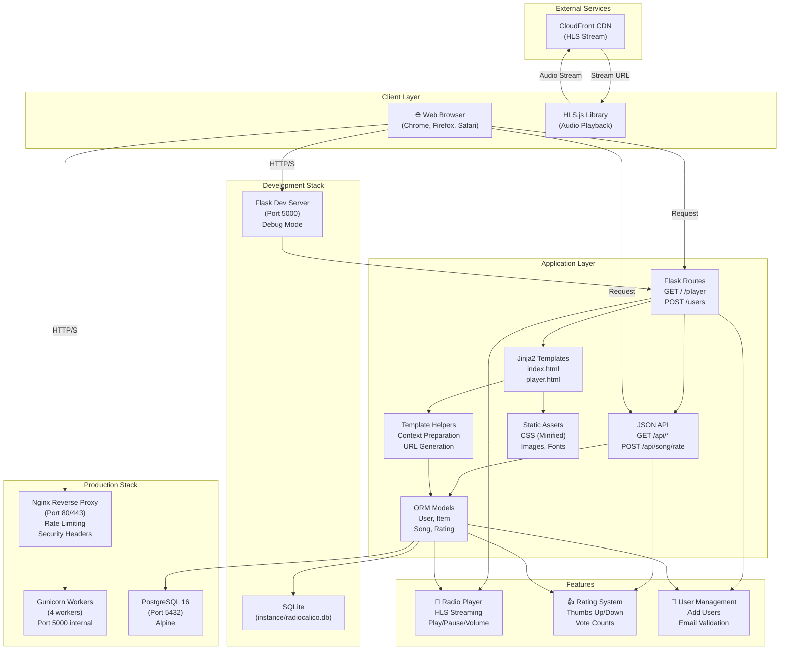
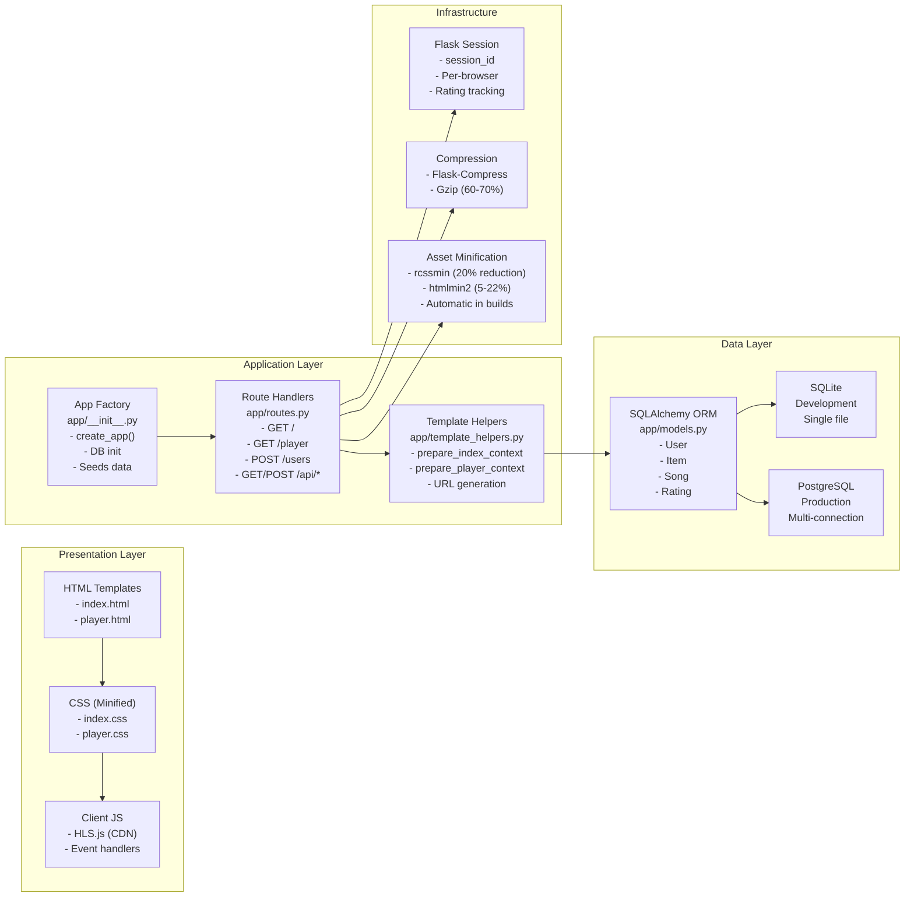
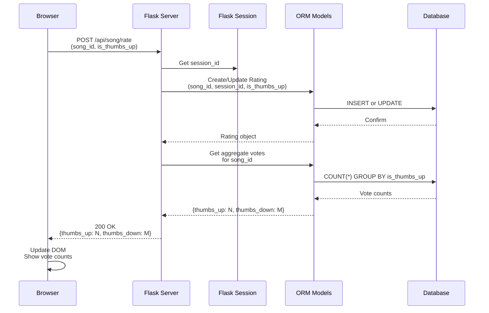
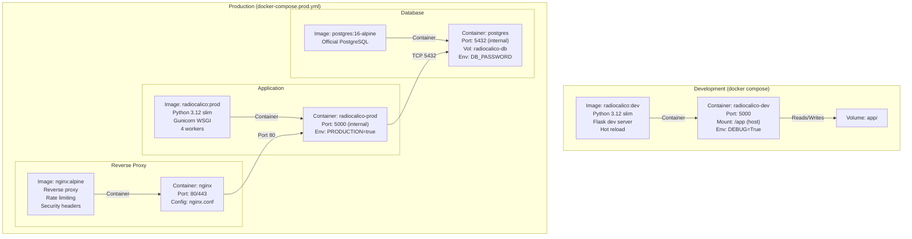
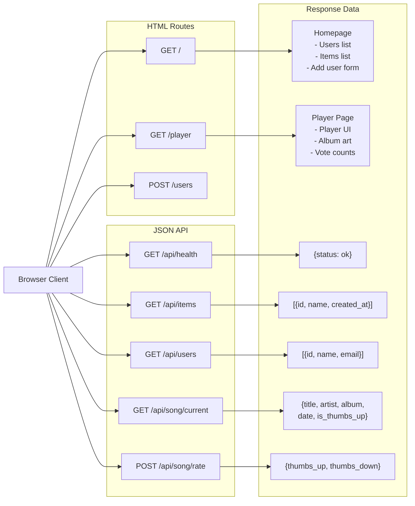
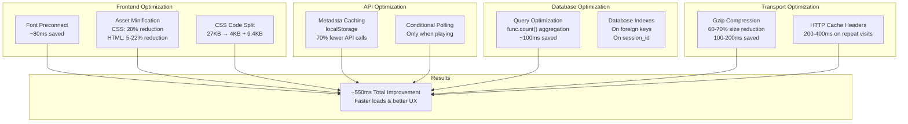
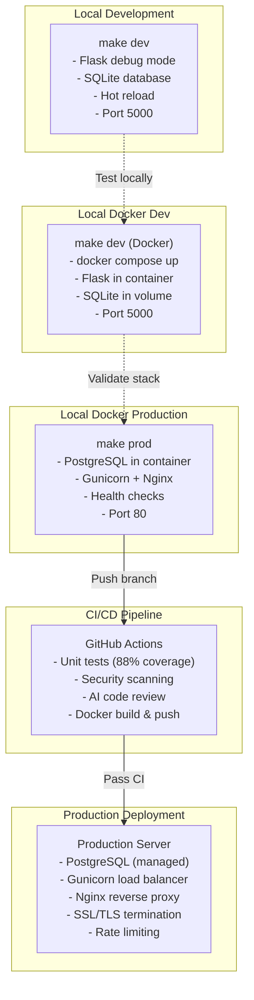

# Radio Calico - System Architecture

Comprehensive system design for the Radio Calico application, showing data flow, component interactions, and deployment topology.

## 📖 Viewing the Diagrams

**No installation needed!** All diagrams render automatically in:
- ✅ **GitHub** — Rendered in the repository
- ✅ **VS Code** — Install "Markdown Preview Mermaid Support" extension
- ✅ **GitLab** — Native Mermaid support
- ✅ **Notion, Confluence** — Paste markdown content
- ✅ **Mermaid Live Editor** — https://mermaid.live/ (copy/paste diagrams)

**Optional:** Export diagrams to PNG/SVG:
- Install `mermaid-cli`: `npm install -g @mermaid-js/mermaid-cli`
- Run: `make arch-html` or `mmdc -i ARCHITECTURE.md -o ARCHITECTURE.html`
- This is **NOT required** for viewing or building the application

## High-Level Architecture



## Component Architecture



## Data Flow - User Rating Workflow



## Docker Deployment Architecture



## API Endpoints Architecture



## Database Schema

```mermaid
erDiagram
    USER ||--o{ ITEM : "has"
    USER ||--o{ RATING : "creates"
    SONG ||--o{ RATING : "rated_by"
    
    USER {
        int id PK
        string name
        string email UK "unique"
        datetime created_at
    }
    
    ITEM {
        int id PK
        int user_id FK
        string name
        datetime created_at
    }
    
    SONG {
        int id PK
        string title
        string artist
        string album
        datetime date
        datetime created_at
    }
    
    RATING {
        int id PK
        int song_id FK
        string session_id
        boolean is_thumbs_up
        datetime created_at
        unique "song_id, session_id"
    }
```

## Performance Optimization Layers



## Deployment Environments



## Security Architecture

```mermaid
graph TB
    subgraph "Input Layer"
        CSRF["CSRF Protection<br/>Flask-WTF<br/>Token validation"]
        InputVal["Input Validation<br/>Email format<br/>Name length<br/>Parameter checks"]
    end
    
    subgraph "Application Layer"
        SQLInject["SQL Injection Prevention<br/>SQLAlchemy ORM<br/>Parameterized queries"]
        XSSPrev["XSS Prevention<br/>Jinja2 auto-escaping<br/>Template safety"]
        SessionIso["Session Isolation<br/>Per-browser session_id<br/>Vote per session"]
    end
    
    subgraph "Transport Layer"
        HTTPS["HTTPS/TLS<br/>SSL certificate<br/>Encrypted traffic"]
        Headers["Security Headers<br/>X-Frame-Options<br/>X-XSS-Protection<br/>Content-Security-Policy"]
    end
    
    subgraph "Infrastructure Layer"
        RateLimit["Rate Limiting<br/>10 req/s general<br/>100 req/s API<br/>Nginx rules"]
        NonRoot["Non-root User<br/>Container UID 1000<br/>Reduced attack surface"]
    end
    
    subgraph "Scanning"
        SAST["SAST Analysis<br/>Bandit (Python)"]
        DepScan["Dependency Scan<br/>Safety check<br/>Dependabot"]
        ImageScan["Image Scanning<br/>Trivy<br/>CVE detection"]
        SecScan["Secrets Scanning<br/>TruffleHog<br/>Credential detection"]
    end
    
    CSRF --> InputVal
    InputVal --> SQLInject
    SQLInject --> XSSPrev
    XSSPrev --> SessionIso
    SessionIso --> HTTPS
    HTTPS --> Headers
    Headers --> RateLimit
    RateLimit --> NonRoot
    NonRoot --> SAST
    SAST --> DepScan
    DepScan --> ImageScan
    ImageScan --> SecScan
```



## Technology Stack Summary

| Layer | Technology | Purpose |
|-------|-----------|---------|
| **Frontend** | HTML5, Jinja2, CSS3 | User interface |
| **Audio** | HLS.js, CloudFront CDN | Streaming playback |
| **Backend** | Flask, Python 3.12 | Web server & API |
| **Database** | SQLite (dev), PostgreSQL (prod) | Data persistence |
| **ORM** | SQLAlchemy | Database abstraction |
| **Templating** | Jinja2 | Dynamic HTML generation |
| **WSGI** | Gunicorn (prod only) | Application server |
| **Reverse Proxy** | Nginx (prod only) | Load balancing, security |
| **Containerization** | Docker, Docker Compose | Reproducible deployments |
| **Compression** | gzip, rcssmin, htmlmin2 | Asset optimization |
| **Testing** | pytest, pytest-flask, pytest-cov | Quality assurance |
| **Security** | Bandit, Safety, Trivy, TruffleHog | Vulnerability scanning |
| **CI/CD** | GitHub Actions | Automated workflows |

## Key Architectural Principles

1. **Separation of Concerns** — Templates focus on display, helpers prepare data, routes handle logic
2. **App Factory Pattern** — Flexible configuration for dev/prod/test environments
3. **Layered Architecture** — Clear boundaries between presentation, application, and data layers
4. **Security by Default** — CSRF protection, SQL injection prevention, XSS escaping, CORS ready
5. **Performance First** — Minification, caching, optimized queries, compression
6. **Infrastructure as Code** — Docker, docker-compose, Makefiles for reproducible environments
7. **Automated Quality** — Tests (164), security scanning (7 tools), AI code review
